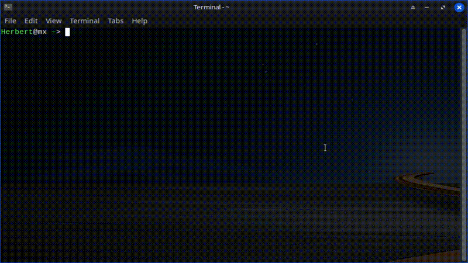

# 💰 Pivot
> A lightweight **CLI** financial management tool built for speed and efficiency.



## 🎯 Overview
Why I built Pivot, was for the final **CS50P** final project, then I realised I have a great idea that I can built on, having a **lightweight**, easy to set up CLI finance tracking program,
no need to download huge aplications just a simple terminal program that allows you to record your daily expenses/income and calculates your balance from any location in the terminal 

### Key Features:
* **Instant Logging:** Quickly add transactions with Descriptions CLI.
* **Data Persistence:** Automatically saves to a local CSV file.
* **Summary Reports:** Easily calculate your real time balance.
* **Validation:** Robust error handling for dates and currency inputs.

## 🛠️ Technical Implementation
* **Language:** Python 3.x
* **Storage:** CSV (Comma Separated Values)
* **Testing:** Pytest (Unit tests for core logic)NB! not required to run the program just used it for testing reasons
* **Environment:** Optimized for **Low end devices**.

## 🌍 Running From Anywhere
To run Pivot as a global command, you can set up a terminal alias.

### My Setup (MX Linux + Fish Shell)
Using the **Fish shell**, I configured Pivot as a system-wide command:
1. `alias Pivot="python3 /path/to/project.py"`
2. `funcsave Pivot`

### For Bash/Zsh Users
Add the following to your `.bashrc` or `.zshrc`:
```bash
alias pivot='python3 /absolute/path/to/project.py'
```
All thats left is to restart your terminal and your all set up.
